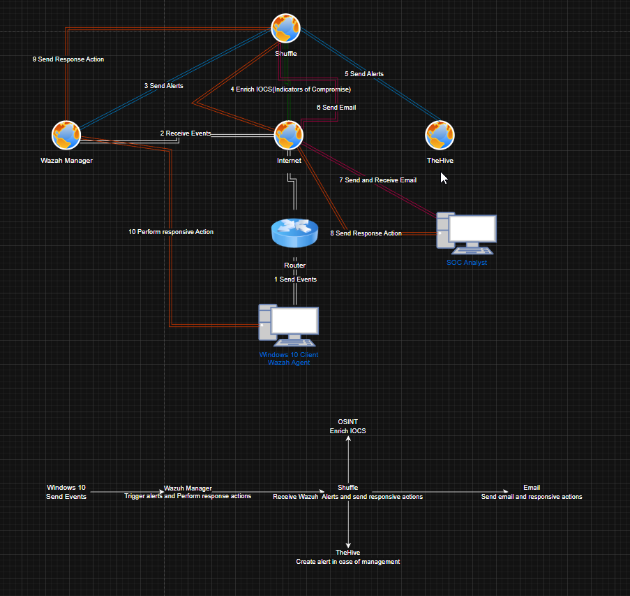
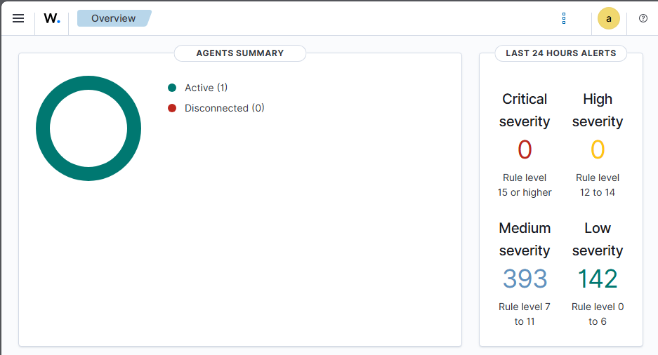
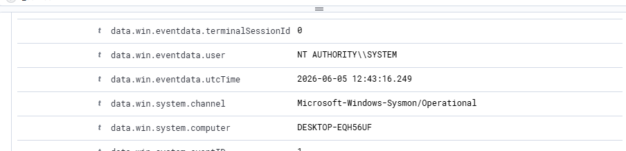
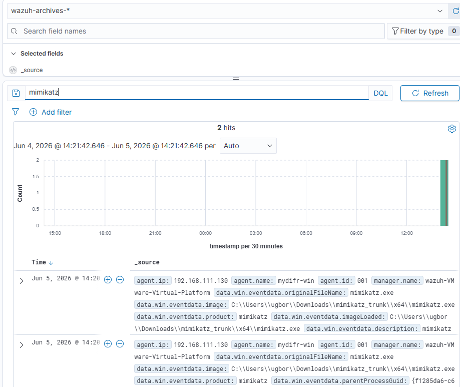
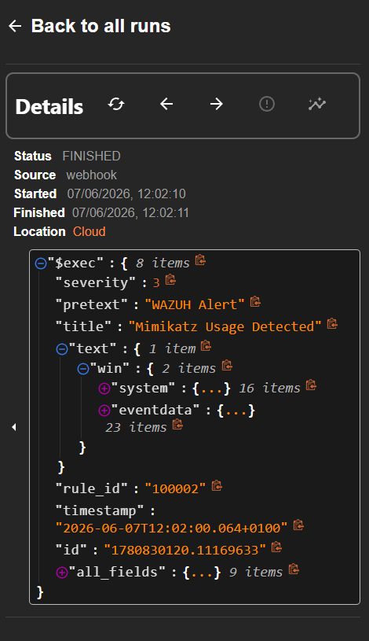
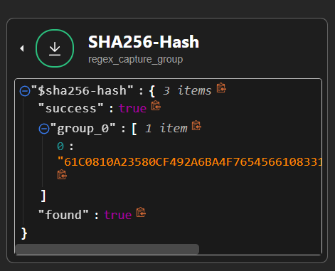
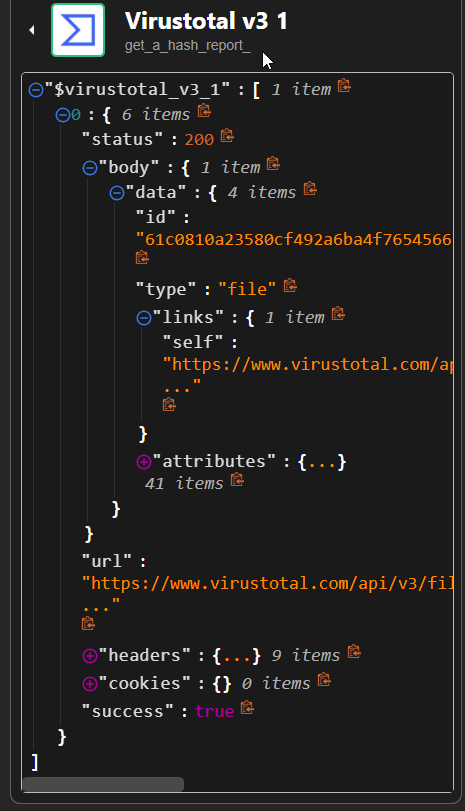
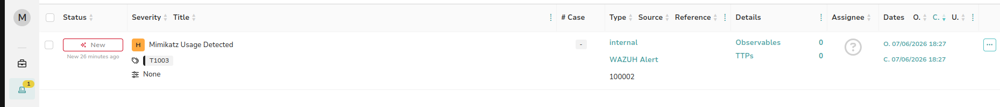

# SOC Automation Homelab

**Author:** Peter Ugbor  
**GitHub:** [rader2001-hash](https://github.com/rader2001-hash)

A fully functional SOC automation pipeline built on local VMs. Wazuh detects a Mimikatz credential dumping attack, Shuffle orchestrates the response, TheHive creates a case, and an email alert goes out to the analyst — all automatically.

---

## Architecture



The pipeline runs across four VMs on VMware Workstation:

| VM | OS | Role |
|---|---|---|
| Windows 10 | Windows 10 | Endpoint + Wazuh Agent + Sysmon |
| Wazuh Server | Ubuntu 24.04 | SIEM + Alert Manager |
| TheHive | Ubuntu 24.04 | Case Management (Cassandra + Elasticsearch) |
| Shuffle | Ubuntu 24.04 | SOAR (Docker) |

---

## How It Works

1. Mimikatz runs on the Windows 10 endpoint
2. Sysmon logs the process creation event
3. Wazuh agent ships the log to Wazuh Manager
4. A custom rule (ID 100002) fires on `originalFileName: mimikatz.exe`
5. Wazuh sends the alert to Shuffle via webhook
6. Shuffle extracts the SHA256 hash using regex
7. VirusTotal enriches the hash
8. TheHive creates a new alert with severity, tags, and host details
9. An email notification goes to the SOC analyst

---

## Tools Used

- **Wazuh 4.x** — SIEM and endpoint detection
- **Sysmon** — Windows telemetry (process creation, network, file events)
- **Shuffle** — SOAR automation (self-hosted via Docker)
- **TheHive 5.x** — Case and alert management (Cassandra + Elasticsearch backend)
- **VirusTotal API** — IOC enrichment
- **Gmail SMTP** — SOC analyst email notification

---

## Custom Mimikatz Detection Rule

```xml
<group name="mimikatz">
  <rule id="100002" level="15">
    <if_group>sysmon_event1</if_group>
    <field name="win.eventdata.originalFileName" type="pcre2">(?i)mimikatz\.exe</field>
    <description>Mimikatz Usage Detected</description>
    <mitre>
      <id>T1003</id>
    </mitre>
  </rule>
</group>
```

Rule level 15 = critical. Mapped to MITRE ATT&CK T1003 (OS Credential Dumping).

---

## Shuffle Workflow


Nodes in order:

1. **Webhook** — receives Wazuh alert JSON
2. **SHA256-Hash** — regex extracts the file hash from `data.win.eventdata.hashes`
3. **VirusTotal v3** — `get_a_hash_report` action
4. **TheHive** — `post_create_alert` action
5. **Email (SMTP)** — sends notification to analyst

---

## TheHive Alert Payload

```json
{
  "description": "$exec.title",
  "flag": false,
  "pap": 2,
  "severity": "$exec.severity",
  "source": "$exec.pretext",
  "sourceRef": "$exec.rule_id",
  "status": "New",
  "summary": "Mimikatz activity detected on host: $exec.text.win.system.computer",
  "tags": ["T1003"],
  "title": "$exec.title",
  "tlp": 2,
  "type": "internal"
}
```

---

## Screenshots

| Step | Screenshot |
|---|---|
| Wazuh agent connected |  |
| Sysmon telemetry in Wazuh |  |
| Mimikatz detected |  |
| Mimikatz in archives index |  |
| Shuffle webhook triggered |  |
| Hash extracted |  |
| VirusTotal enrichment |  |
| TheHive alert created |  |
| Email received |  |

---

## Key Configs

**Wazuh ossec.conf — Sysmon log collection (Windows agent)**
```xml
<localfile>
  <location>Microsoft-Windows-Sysmon/Operational</location>
  <log_format>eventchannel</log_format>
</localfile>
```

**Wazuh ossec.conf — archive logging enabled**
```xml
<alerts_log>yes</alerts_log>
<logall>yes</logall>
<logall_json>yes</logall_json>
```

**Filebeat — archives enabled**
```yaml
filebeat.modules:
  - module: wazuh
    alerts:
      enabled: true
    archives:
      enabled: true
```

---

## Challenges

- Elasticsearch duplicate field error on TheHive VM — fixed by removing a duplicate `cluster.initial_master_nodes` entry in `elasticsearch.yml`
- Elasticsearch X-Pack security blocking TheHive — fixed by setting `xpack.security.enabled: false` for the homelab
- OOM killer terminating Elasticsearch — fixed by increasing TheHive VM RAM from 4GB to 8GB
- Shuffle cloud could not reach local TheHive — fixed by switching from Shuffle cloud to a self-hosted Shuffle instance on a local VM

---

## Notes

This lab runs entirely on local VMs with no cloud services. Everything communicates over a bridged VMware network. The setup intentionally mirrors a real SOC environment at small scale — endpoint, SIEM, SOAR, and case management all talking to each other automatically.
